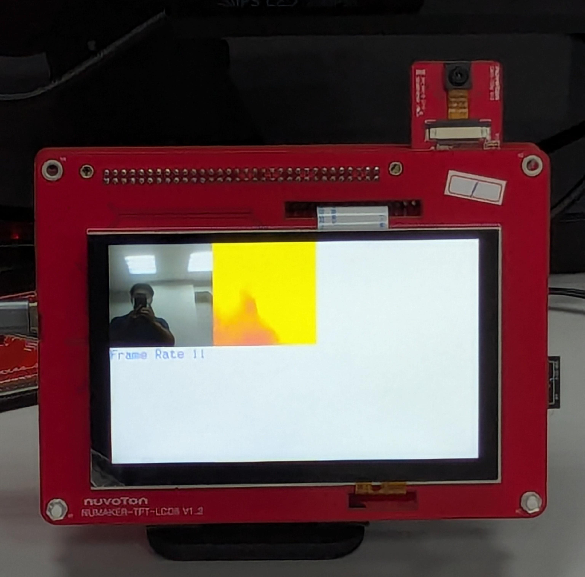

# DepthEstimation
A demonstration sample for image depth estimation. Depth estimation is particularly useful in scenarios involving robotics, autonomous navigation, and augmented reality on mobile or embedded platforms.
## Model Information
FastDepth is a lightweight neural network designed for real-time monocular depth estimation from a single RGB image, optimized for embedded systems like microcontrollers and edge devices.  

|Information||
|:----|:----|
|Framework|TensorFlow Lite|
|Quantization| INT8|
|Paper|https://arxiv.org/abs/1903.03273|
|Provenance|https://github.com/Hagaik92/FastDepth|

## Requirement
1. Keil uVision5
## Howto
1. Build by Keil
2. Copy Model/FastDepth_224.tflite file to SD card root directory.
3. Insert SD card to NuMaker-M55M1 board
4. Run
## Performance
System clock: 220MHz
| Model |Input Dimension | ROM (KB) | RAM (KB) | Inference Rate (inf/sec) |  
|:------|:---------------|:--------|:--------|:-------------------------|
|FastDepth|224x224x3|2026|2453|18|

Total frame rate: 11 fps
## Result

## Conclusions
This sample uses a pre-trained model from Hagaik92's repository. The basic architecture of the model is MobileNet v2, so it is easy to convert it into a quantized model executable by the NPU to achieve faster inference speed.

In actual field testing, there is a phenomenon that even if the CMOS input image is still, the output visual depth image will still change. However, judging from the video on https://fastdepth.mit.edu/, this model seems to exhibit this phenomenon.

