* * *

**Required VSCode Extension**

1.  Nuvoton NuMicro Cortex-M pack
2.  Zephyr IDE Extension Pack

* * *

**Install Zephyr IDE**

1.  Install Zephyr IDE Extension Pack from VSCode  
    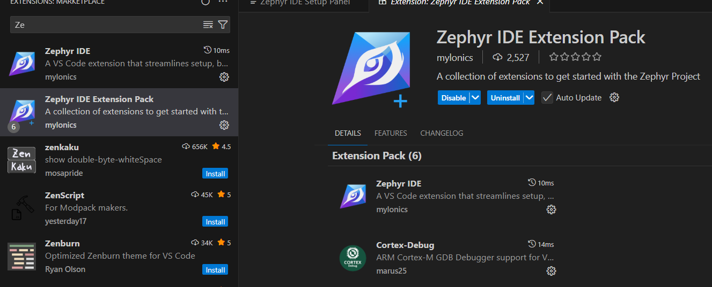
2.  Install Host Tools  
    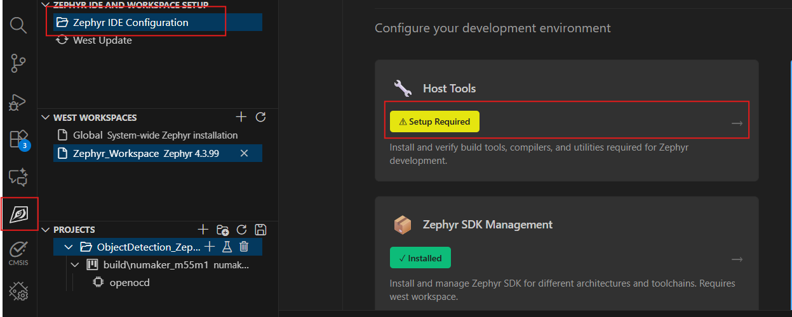
3.  Open a workspace folder and run workspace setup  
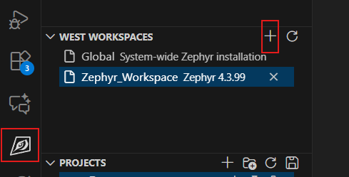  
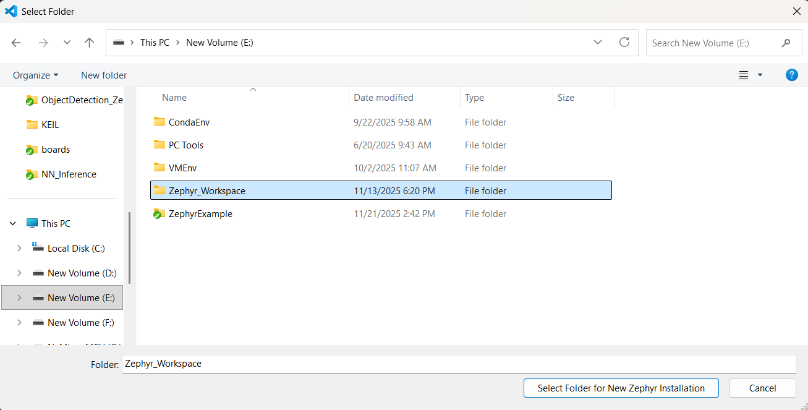  
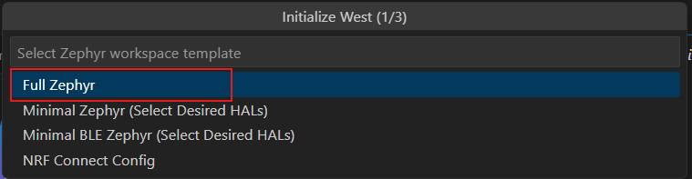  
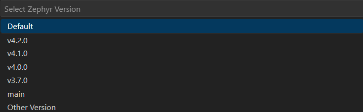  
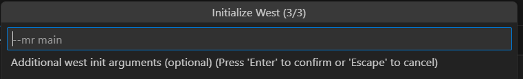  
4.  After a few minutes... The workspace folder would be  
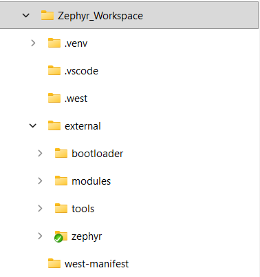  
5. Activate workspace  
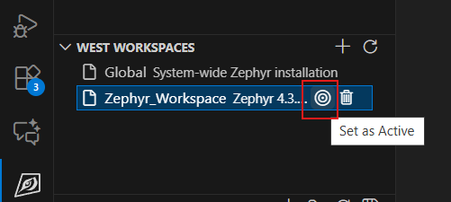  
6.  Install SDK(Toolchain)  
    Toolchain install path would be `C:\Users\chche\.zephyr_ide\toolchains`
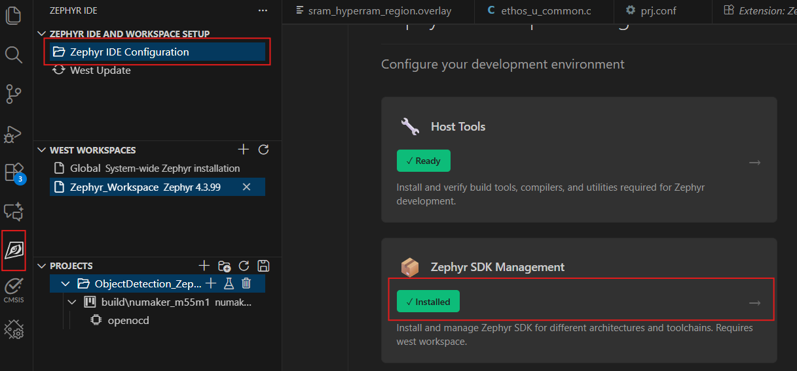  
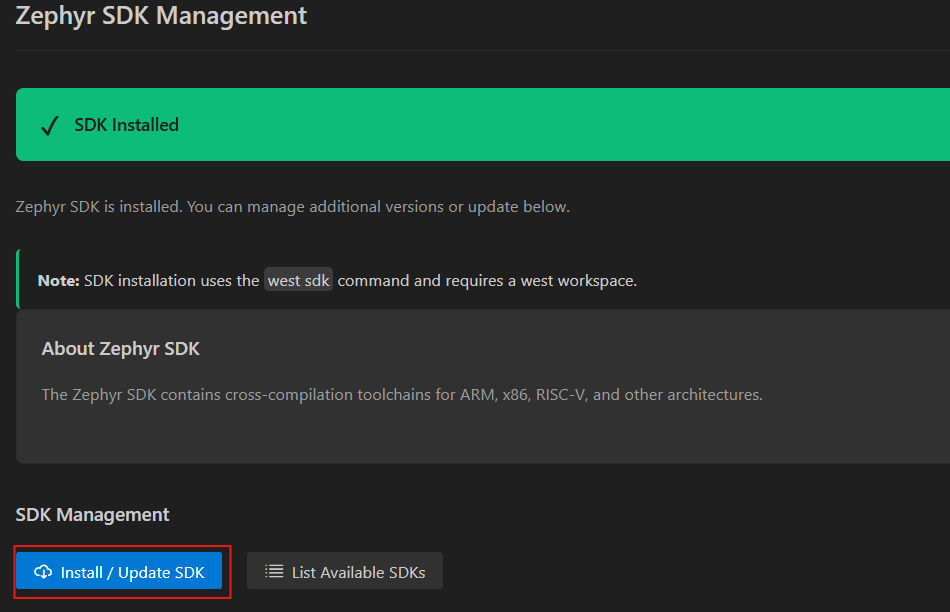  
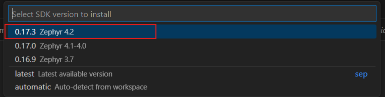  
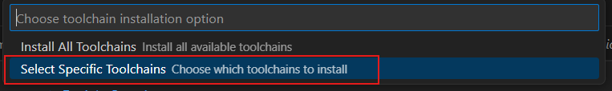  
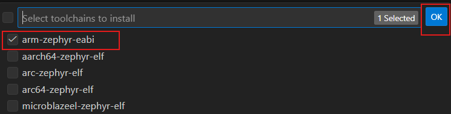  
7.  Run "West Update"  
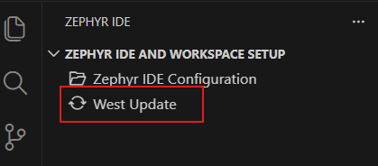  

* * *

**Create Project**

1.  Copy a basic sample from zephyr sample (Ex: E:\\Zephyr_Workspace\\external\\zephyr\\samples\\basic\\blinky) to your new project directory
2.  Modify new project name (NNInference) and CMakeLists.txt
3.  Add project to IDE  
    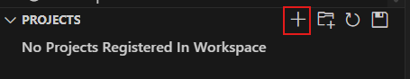  
    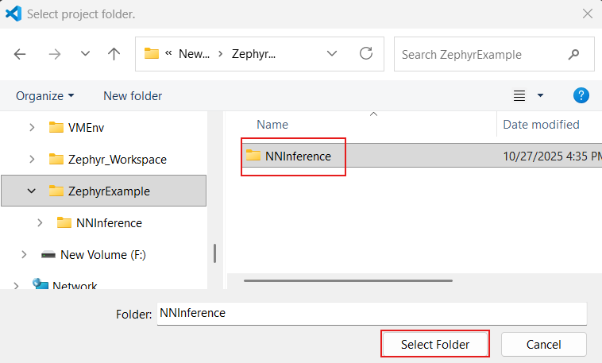  
    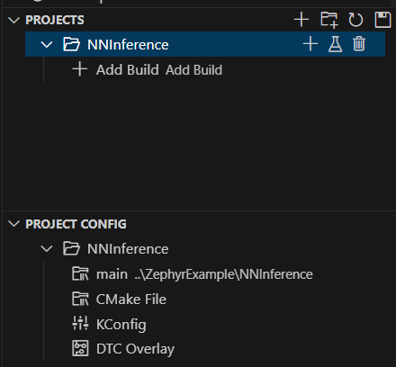

* * *

**Build Project**  
1.Add Build  
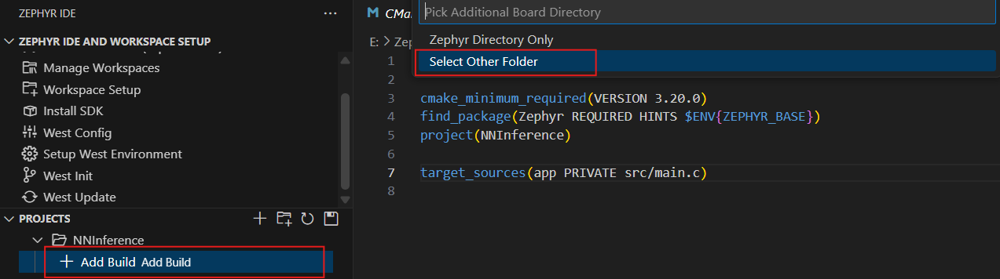  
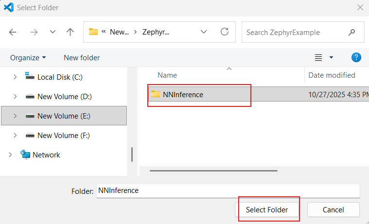  
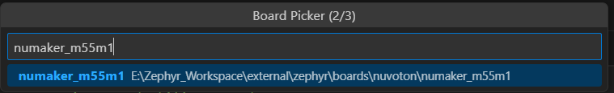  
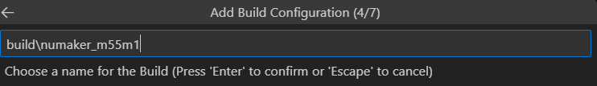  
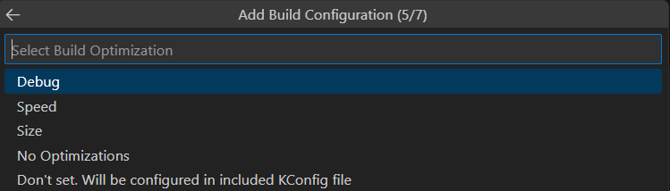  
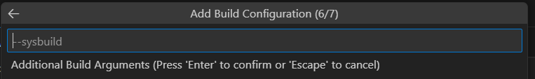  
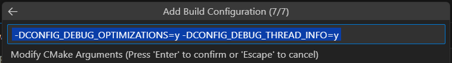  
2\. Build  
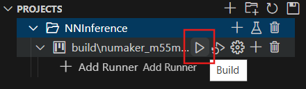  
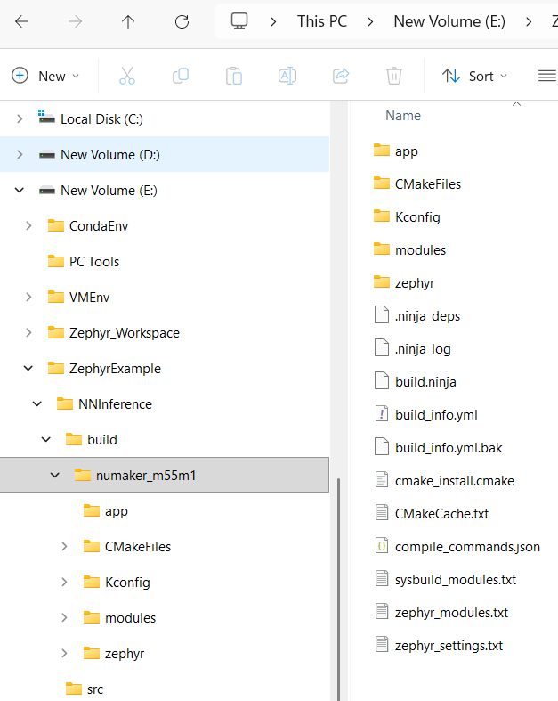

* * *

**Flash**

1.  Add runner configuration(OpenOCD). Configure the project runner to use OpenOCD  
    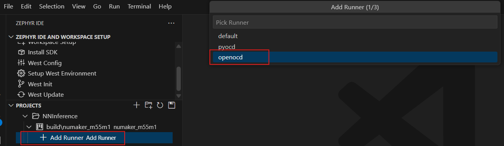  
    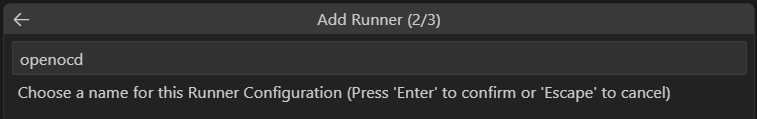  
    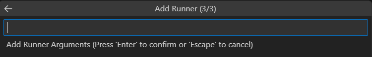  
    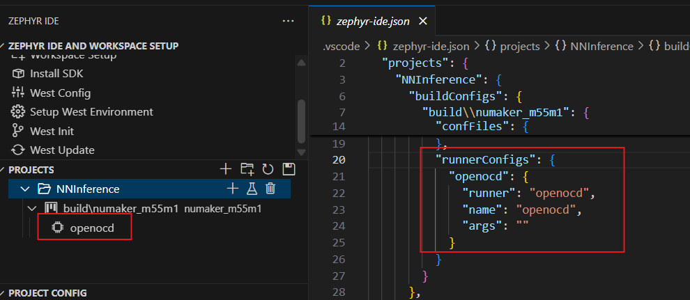
2.  Update runner settings  
    Go to `View -> Command Palette` and run `Update Zephyr Project Runner`. Select the project to update the runner and refresh the settings  
    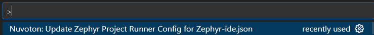  
    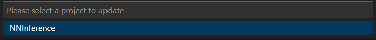  
    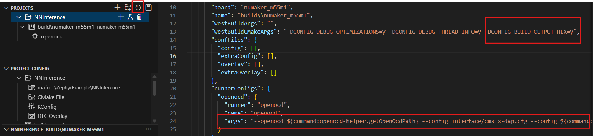
3.  Set the target type from CMSIS extension. Please choose the target type.  
    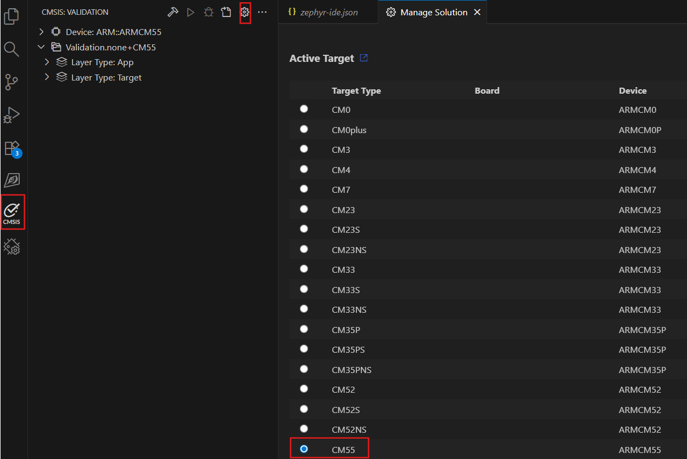
4.  Build project and Flash  
    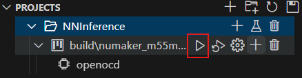  
    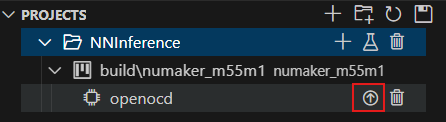  
    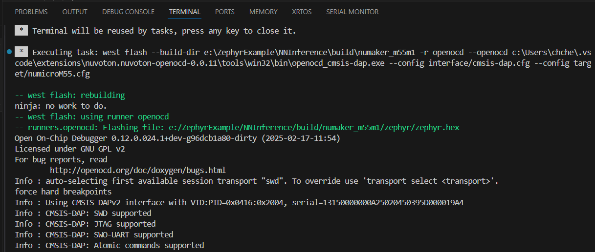

* * *

**Debug**

1.  Create launch.json for debugging  
    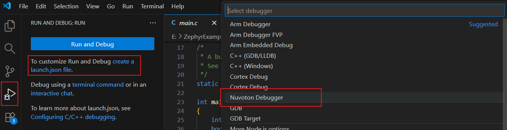
2.  Setup the runToEntryPoint(optional). You can specify the symbol function where your want to stop (for example, Zephyr's execution entry point is z_arm_reset). Default is main().  
    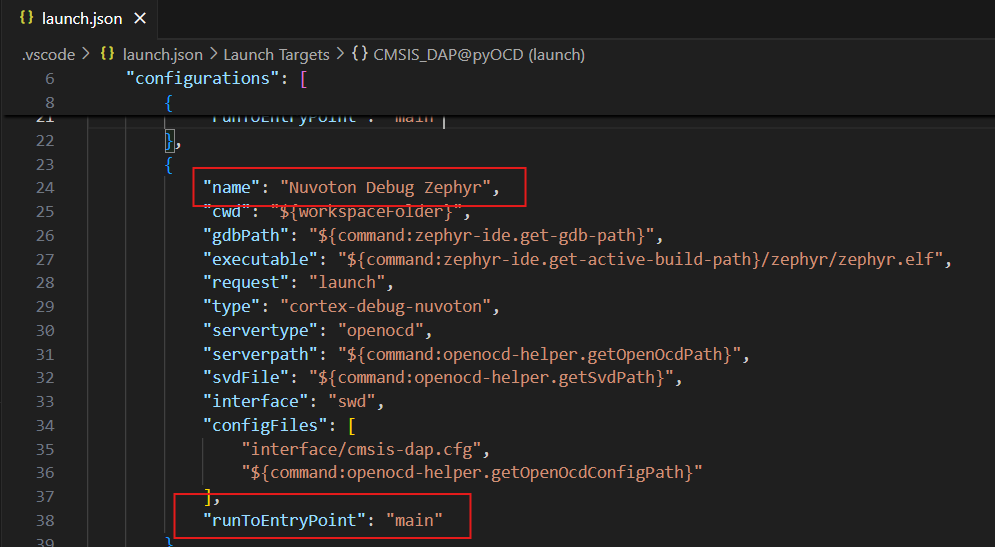
3.  Select Debug Setting. Select `Nuvoton Debug Zephyr`  
    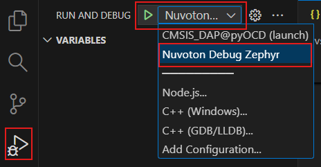
4.  Enter Debug Mode and Start Monitior for output

* * *

**Others**

1.  Zephyr-ide.json location  
    \$Zephyr_Workspace/.vscode/zephyr-ide.json

* * *

**Reference**

1.  Nuvoton NuMicro Cortex-M pack  
    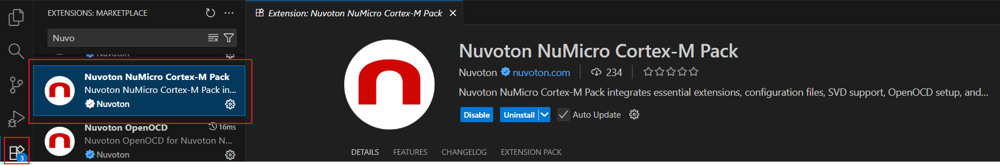