# YOLOX-Nano Object Detection Sample #

This is a YOLOX-Nano neural network inference sample for object detection running on the Nuvoton M55M1 microcontroller with the Zephyr RTOS. Here's what it does:

Key Features:
1. Real-time Object Detection: Uses the YOLOX-nano model (a lightweight variant of YOLO) to detect objects in images captured from an image sensor (HM1055).
2. Hardware Acceleration:
    - Leverages the Ethos-U NPU (Neural Processing Unit) for accelerated AI inference.
    - Uses HyperRAM for model storage (external high-capacity memory).
    - Supports I/D caching for improved performance.
    - Custom SRAM configuration for optimal memory layout.
3. Image Capture & Processing:
    - Captures images from an HM1055 image sensor via CCAP (Camera Capture).
    - Resizes images to the model's input dimensions (RGB565 → RGB888) for non-preview case.
    - Quantizes data for efficient model inference.
    - BYTETracker for person tracking across frames.
    - Draws bounding boxes on detected objects.
4. Multi-threaded Architecture:
    - Main task: Handles image capture and display.
    - Inference task: Processes AI inference independently.
    - Uses Zephyr message queues for thread synchronization.
5. Optional Features:
    - UVC (USB Video Class): Preview result image over USB.
    - SD card Support: Load the model from SD card instead of embedding it.
    - Profiling: Performance monitoring and cycle counting.
    - LCD display: Preview result image over LCD.
    - Formatted object detection message: Output structured detection result message over UART.

Software Stack:
- TensorFlow Lite Micro with CMSIS-NN optimization.
- Arm ML Embedded Evaluation Kit for common ML utilities.
- OpenMV (OMV) library for image processing.
- Zephyr OS for real-time task scheduling.
- FatFS for SD card file system.

## Model Information ##
YOLOX (You Only Look Once – X) is a high-performance, anchor-free object detection framework.
It improves upon earlier YOLO versions (YOLOv3–YOLOv5) by introducing:
- Anchor-free design → simplifies training and improves generalization.
- Decoupled head architecture → separates classification and localization tasks for better accuracy.
- Advanced training strategies like label assignment and strong augmentation.

YOLOX-Nano is an ultra-lightweight YOLOX model optimized for low-power devices (MCUs, mobile CPUs, NPUs). It offers lower accuracy compared to larger YOLOX models (YOLOX-S, YOLOX-M and YOLOX-L), but much faster and lighter.

|Information||
|:----|:----|
|Framework|PyTorch|
|Paper|https://arxiv.org/abs/2107.08430|
|Provenance|https://github.com/Megvii-BaseDetection/YOLOX|
|Parameters| ~0.9M|
|COCO mAP(0.5:0.95)| 0.200|
|Model ROM size|1289KB|
|Model RAM(arena) size|512KB|

[NuEdgeWise](https://github.com/OpenNuvoton/ML_YOLO) provides YOLOX Nano-related transfer learning scripts and model conversion tools (from PyTorch to tflite). You can customize your own classes in this environment and deploy to M55M1.

## Memory(RAM) Region ##
This sample demonstrates the regions of the M55M1 memory in the following:

| Region | Address | Size | Memory Type | Data Context | DTC Overlay | Memory Attribute |
|:----|:----|:----|:----|:----|:----|:----| 
|RAM|0x20100000|128KB|Part of SRAM0|Kernel read-write data|sram0_128K.overlay|DT_MEM_ARM_MPU_RAM|
|DTCM|0x20000000|128KB|DTCM|System heap and stack||DT_MEM_ARM_MPU_RAM|
|SRAM_NON_CACHE|0x20110000|1216KB|Part of SRAM0, SRAM1 and SRAM2|Model arena cache and image buffer|sram_non-cache_region.overlay|DT_MEM_ARM_MPU_RAM_NOCACHE|
|EBI0|0x60000000|1024KB|EBI0|MPU-type LCD device|ebi_lcd_region.overlay|DT_MEM_ARM_MPU_DEVICE|

## Setup and Build ##
This sample is based on Zephyr RTOS. Please follow the steps below to install and setup the compilation environment.
1. Follow [Zephyr IDE with NuMicro Cortex-M on VSCode](../../Doc/Zephyr/Zephyr%20IDE%20with%20NuMicro%20Cortex-M%20on%20VSCode.md) guiding to install Zephyr host tool, SDK and workspace. Make sure the zephyr revision of workspace >= v4.3.0

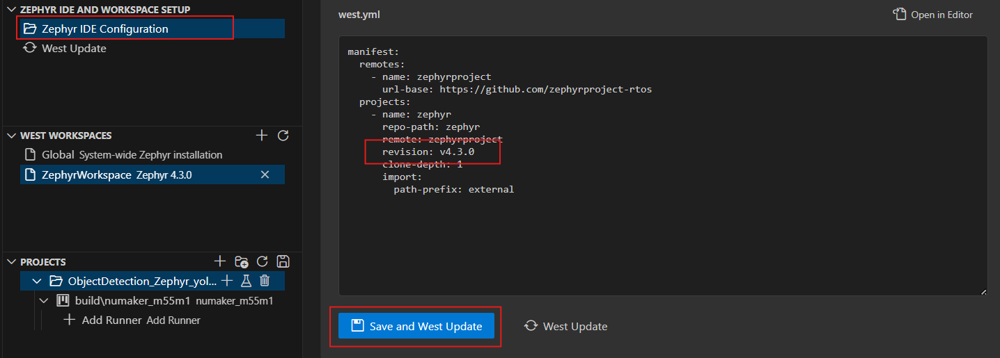

2. Install tflite-micro external module
```
west config manifest.project-filter -- +tflite-micro
west update
```
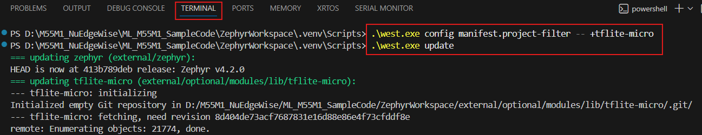

3. Add sample project


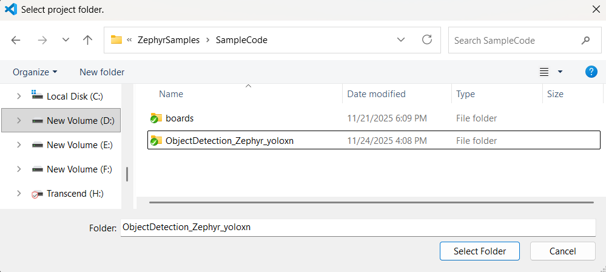

4. Add project build


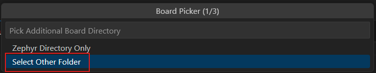

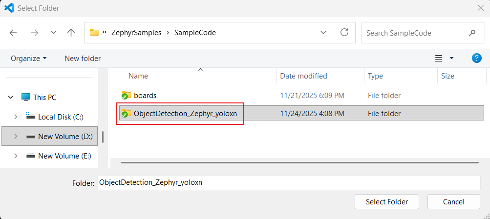

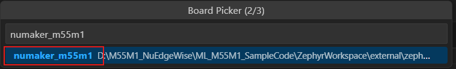

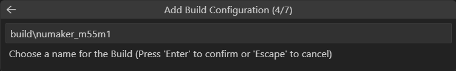

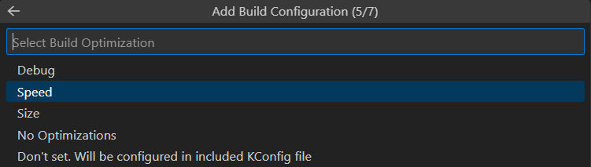

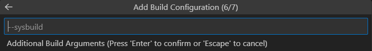

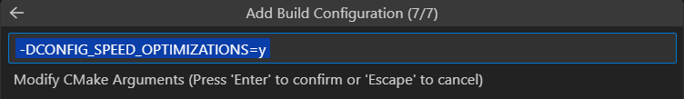

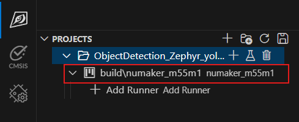

5. Add DTC overlay

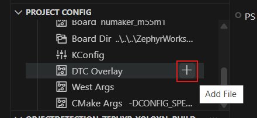

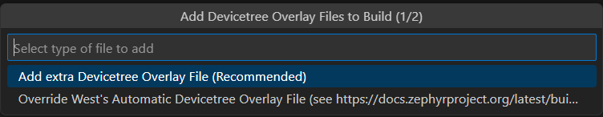 

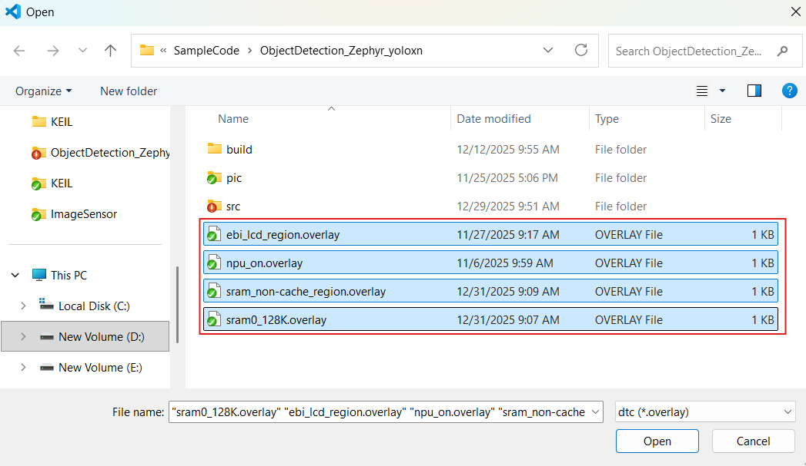

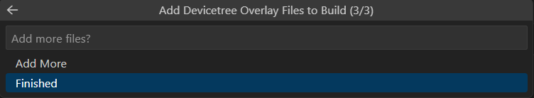

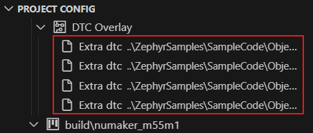

6. Pristine build

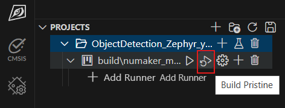

## Program Flash and Debug ##
Please follow [Zephyr IDE with NuMicro Cortex-M on VSCode](../../Doc/Zephyr/Zephyr%20IDE%20with%20NuMicro%20Cortex-M%20on%20VSCode.md) guiding to setup openocd runner.

## Configuration ##
This sample supports the following application configurations. You can change the settings by MenuConfig/GuiConfig, or modify prj.conf file directly.
- ```CONFIG_APP_OD_PROFILE_ENABLED``` (default n): Enable/disable application profiling on each stage, which includes NPU inference, CCAP capture, image resize, post processing cycles.
- ```CONFIG_APP_OD_UVC_SHOW_IMAGE``` (default n): Enable/disable the display of the result image over UVC connect.
- ```CONFIG_APP_OD_MODEL_FROM_SD``` (default n): Support loading model from SD card to HyperRAM
- ```CONFIG_APP_OD_LCD_SHOW_IMAGE``` (default n): Enable/disable the display of the result image over LCD.
- ```CONFIG_APP_OD_FORMATTED_MESSAGE ``` (default n): Enable/disable foramtted objcet detection message.
    - Message Header:
    ```
    [AA][DD][0 0 0 0][55][CC] 
    ```
    - For each detected objects:
    ```
    [AA][ID_BYTE][x y w h][55][CC]
    where:
        - [AA] - Message start marker
        - [ID_BYTE] - Mapped class/track ID (2 hex digits):
            - For person ID: 00 ~ 7F
            - For gesture ID: 80 ~ 8A
        - [x y w h] - Bounding box coordinates (4 decimal values)
        - [55] - Message middle marker
        - [CC] - Message end marker
    ```
    - Message Footer:
    ```
    [AA][FF][0 0 0 0][55][CC]
    ```
    - Empty Detection Message (when no objects):
    ```
    [AA][EE][0 0 0 0][55][CC]
    ```


## Performance
1. Memory usage

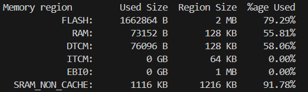  

2. Frame rate and inference rate  
System clock: 220MHz  

| Model |Input Dimension | Model Inference Rate (inf/sec) |  
|:------|:---------------|:-------------------------|
|YOLOX-Nano|320x320x3| 43.6|  

|Display(show result)| Applicaton Frame Rate (fps) |  
|:------|:-------------------------|
|Non-preview| 34|
|UVC| 14|
|LCD| 15|

